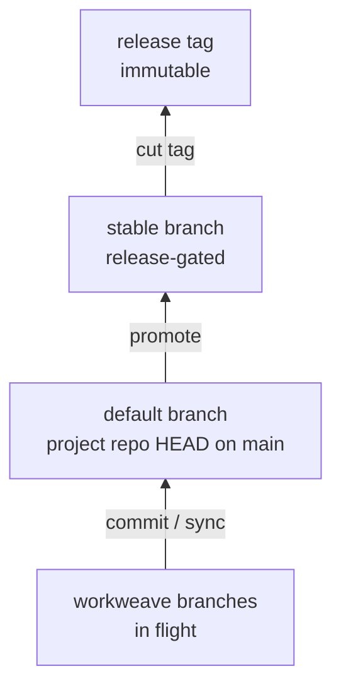

# Pyramid of stability

A cross-repo project does not have a single "tip." Each constituent repo
moves on its own schedule. The audience for a project — collaborators on
other machines, CI, agents starting from cold — needs a way to ask the
question every single-repo developer takes for granted: *what is the
current state?*

This joint defines what "stable" means for a repoweave project and how
the tool surfaces that stability.

## The problem the metaphor names

In a single-repo project, `HEAD` is the answer. `git fetch && git checkout
main` reproduces "what everyone is working from." There is one moving
part.

In a multi-repo project, the equivalent question — *what set of
revisions, across every constituent repo, should I be looking at right
now?* — does not have a built-in answer. Each repo's `main` advances
independently. Picking "each repo's latest `main`" gives you a set of
revisions no one has ever tested together. Picking "each repo at the
last release tag" overconstrains: most ongoing work happens against
revisions that no one has cut a release of yet.

The project needs its own notion of *canonical tip* — a recorded set of
per-repo revisions that "what is the current state" resolves to. The
recording is the project's job, not any individual repo's.

## Pyramid, not flat list

Real projects have multiple canonical tips, not one. A working metaphor:



Each tier is a *channel* — a place a collaborator might point `rwv
fetch` at. Each channel has its own cadence:

- **Workweave branches** advance on every cross-repo edit. Constituent
  repos move freely.
- **Default branch** of the project repo advances when a workweave's
  cross-repo work lands. Each landing is one project-repo commit that
  re-pins the constituent-repo SHAs.
- **Stable branch** advances when the maintainer promotes the default
  branch (typically after release-gating runs). It moves rarely; its
  consumers want minimum churn.
- **Release tags** are immutable. Cutting one is a forward-only choice.

The pyramid is a discipline pattern, not a tool feature: nothing in rwv
forces this shape. But the shape falls out naturally because every
project repo is a git repo, and every branch in that git repo carries
its own `rwv.lock`. Collaborators choose which channel to track by
checking out that branch:

```bash
# Check out the project at a specific channel before fetching
git -C projects/chatly/web-app checkout stable   # stable channel
git -C projects/chatly/web-app checkout v1.2.3   # release tag
rwv fetch chatly/web-app                          # align repos to that lock
```

That last set of revisions is reproducible byte-for-byte because the
lock pins SHAs, not branches.

## What "stable" means at the project level

A repoweave project is "stable" when:

1. Every constituent repo on disk is at exactly the SHA recorded in
   `rwv.lock`.
2. The project repo itself is at a committed HEAD that includes that
   lock.

Condition (1) is what [`rwv doctor`](../../reference/cli.md) checks; the
[lock-as-derived](./lock-as-derived.md) joint explains how the lock
gets there.

Condition (2) means the cross-repo state is *citable*: a single
`projects/<name>/` SHA names the entire pyramid tier. `sha256sum
rwv.lock` is the multi-repo equivalent of `git rev-parse HEAD` for a
flat repo.

Stability is per-channel, not global. The default branch may be in flux
while the stable branch is quiet; both can be reproducibly checked out.
The pyramid metaphor names this without inventing new vocabulary: a
channel is a branch is a `rwv.lock` is a set of SHAs.

## How `rwv.lock` operationalizes the pyramid

`rwv.lock` is the artifact that makes the pyramid possible. Without it,
each tier would only name itself by branch name in the project repo —
which is useful but doesn't pin constituent-repo SHAs. Two collaborators
syncing to the same project-repo branch yesterday and today could see
different constituent-repo content.

With the lock:

- The lock is committed alongside the project-repo state it derives from
  ([lock-as-derived](./lock-as-derived.md)).
- Each project-repo branch carries its own lock. The stable branch's
  lock points at revisions that survived release-gating; the default
  branch's lock follows ongoing work; a feature workweave's branch has a
  lock at whatever the workweave was last left at.
- `rwv fetch` reads the lock from the current project-repo HEAD and
  aligns each constituent repo to it. The collaborator's experience is
  "check out the channel; rwv brings the rest of the universe with it."

That is the whole machinery. Nothing in rwv says "this branch is the
stable channel" — it is just a branch with a particular promotion
discipline applied to it. Tool-feature is `rwv.lock` + `rwv fetch` +
`rwv sync`. Convention is the pyramid shape the team chooses to apply.

## Concept versus tool feature

Worth being explicit about which parts of this joint are mechanical and
which are pattern:

| Element | Concept or tool feature |
|---|---|
| Canonical tip (one set of recorded SHAs) | Tool feature — `rwv.lock` |
| `rwv fetch` materializes a tip | Tool feature |
| `rwv sync` advances a tip | Tool feature |
| Multiple tiers (default / stable / release) | Concept — branches in the project repo |
| Promotion between tiers | Concept — `git merge`, `git tag` |
| Channel-by-branch naming | Concept — branch-name discipline |

Adding rwv-side verbs for "promote default to stable" would conflate
weave operations with repo operations. Cutting a release tag, promoting
a branch, gating on test results — those are all ordinary git
operations against the project repo. rwv stays out of them deliberately.
See [verb-vs-composition](./verb-vs-composition.md) for the principle.

## Related joints

- [clone-topology](./clone-topology.md) — the tier below this one. The
  revisions a `rwv.lock` names are only meaningful when each constituent
  repo is the right physical artifact; the topology spec defines that.
- [lock-as-derived](./lock-as-derived.md) — `rwv.lock` is always output,
  never input; how it gets generated.
- [sync-semantics](./sync-semantics.md) — how a tip moves between
  workspaces.
- [verb-vs-composition](./verb-vs-composition.md) — why
  promotion/release verbs are not part of rwv's surface.
