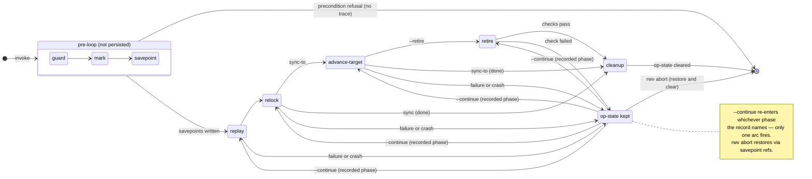

# Sync semantics

Two verbs, two directions:

- **`rwv sync <source>`** — CWD absorbs the source workspace's committed
  state; CWD's unique commits land on top of source's tip. CWD changes;
  source is read-only.
- **`rwv sync-to <target>`** — CWD's committed state lands in the target
  workspace. CWD absorbs target's state first (CWD's commits on top),
  then the target fast-forwards to CWD's new tip. Both CWD and target
  change; the named target ends up with CWD's commits linearly above
  its prior state.

Together they form a direction-explicit pair. The mental model is the
same as `cp` vs. the destination-first convention in `rsync --dest`: the
argument position identifies what moves where. See "Symmetries and
asymmetries" below for the full contract.

Both verbs share a single data-driven phase machine. Plain `sync` is
the degenerate case: it runs the machine with the advance-target and
retire phases absent. `rwv sync-to` runs the full machine, with
advance-target always present and retire added only when `--retire` is
set.

This joint covers the phase machine, the record schema, the strategy
choices, abort's verified-restore contract, snapshot-read semantics,
retire-as-phase, and the named-override naming rule.

## The phase machine

One data-driven machine drives both `rwv sync` and `rwv sync-to`. The
sequence of steps in execution order:

```
guard → mark → savepoint → replay → relock → advance-target → retire → cleanup
                                              (sync-to only)   (--retire only)
```

### Reference repos exit the sync graph

A `role: reference` repo is materialized as a **symlink** aliasing the
single canonical weave-root clone shared by every workweave (see
[`clone-topology.md`](clone-topology.md)). Such a checkout classifies as
`CheckoutKind::ReferenceAlias`. Every phase above — savepoint, replay,
advance-target, abort, plus materialize/prune — would otherwise operate
*through the symlink onto that shared canonical store*: writing
`refs/rwv/pre-op/*` into it (cross-workweave ref collisions), rebasing or
fast-forwarding its branch, `reset --hard`-ing it on abort, or
worktree-adding/removing against it. That mutates a store every workweave
reads.

A reference symlink is read-only, lock-pinned, and byte-identical across
workweaves, so **there is nothing to sync** — exactly as reference repos
are already excluded from `rwv push`, the integration/build graph
(`Role::is_active()`), and `update`. Sync therefore **excludes
`ReferenceAlias` checkouts from its per-repo phase set by construction**:
every mutating phase computes the on-disk checkout path and gates it
through a single predicate (`checkout_is_syncable` — true iff the path is
an existing, non-symlink worktree), so the shared canonical store is
*unreachable* from all of them. Unreachable beats guarded: a per-call-site
guard can be forgotten at the next site; an absent element cannot be
operated on.

The exclusion keys on **alias-ness, never on role**. A reference repo
created with `--worktree-references` is a real worktree on its own
ephemeral branch — sync only ever moves *that* branch, never the
canonical's shared `main`, so it is safe and syncs exactly like any
`owned`/`fork` worktree. Keying the skip on `role == Reference` would
silently break that escape hatch.

`rwv lock` is unaffected: it reads HEAD through the symlink (which
resolves to the canonical) and correctly pins the shared SHA. Reference
repos **stay in the lock** for reproducibility and `rwv fetch`; only
sync's advancement/mutation skips them, and they remain in any
informational status/reporting.

### State diagram

The diagram shows the states a sync operation can be in. The grey box
(`guard → mark → savepoint`) runs once before the driver loop and is not
persisted; a crash there leaves no trace. The white states (`replay`
onward) are the phases the driver persists in `.rwv-op` before entering
each one.



**Which phases run by verb:**

| Phase | `rwv sync` | `rwv sync-to` | `rwv sync-to --retire` |
|---|:---:|:---:|:---:|
| guard / mark / savepoint | yes | yes | yes |
| replay | yes | yes | yes |
| relock | yes | yes | yes |
| advance-target | — | yes | yes |
| retire | — | — | yes |
| cleanup | yes | yes | yes |

**Op-state lifecycle:**

| Exit path | Owner record + leases |
|---|---|
| Precondition refusal (guard, before any mutation) | No trace left |
| All phases complete (cleanup) | Cleared everywhere |
| Phase failure or crash | Kept everywhere; `--continue` resumes, `rwv abort` restores |
| `retire` check failure | Kept at `retire` phase; `--continue` retries checks |
| `rwv abort` completes | Cleared after verified restore |

The guard, mark, and savepoint steps run once before the driver loop.
The persisted record then names which phase the driver is in — the
single source of truth for op state. The driver writes the phase before
entering it, so a crash at any instruction re-enters the same phase on
resume (idempotent by construction). `--continue` for both verbs is:
load the owner record (following a lease pointer if invoked from a
non-owner workspace), enter the driver loop.

### guard

Runs all preconditions before any mutation. Covers: no-op-in-progress
check on every workspace the op will touch, replay-exclusion invariant
(`rwv.lock merge=rwv-ours` in committed `.gitattributes`), lock freshness,
Phase 1' ancestor check (`--strategy=ff`), and the dirty-target
preflight (`rwv sync-to`). Refusals here leave no trace.

**Acquisition atomicity.** The no-op-in-progress check is not
a plain read followed by a later write. `sync` / `sync-to` acquire the
owner record and every touched-workspace lease **atomically at guard
time** via `O_CREAT|O_EXCL`: the OS refuses the second creator, so two
concurrent invocations cannot both pass the guard and only collide later
at the git layer. On `AlreadyExists`, the caller sees the standard
in-flight refusal (verb, age, phase, `--continue` / `rwv abort` exits)
reading the *existing* holder. Every precondition that follows runs
after acquisition; on refusal, the acquired records are cleared (the
cleanup-table row "precondition refusal → cleared everywhere"), so
refusals still leave no trace. Content is published via a sibling temp
file + `link(2)` so a loser never reads a half-written owner file.

Time is never a decision input: crash between acquisition and Mark
leaves records with no savepoints. That partial state is diagnosed by
the doctor's structural dead-lease check (a `.rwv-op-lease` whose
recorded owner workspace has no matching `.rwv-op` for the same op id
is provably dead — safe to auto-fix by removing the lease file).
Elapsed time is surfaced to the operator as observability, never
consumed as a timeout.

### mark

Update the owner record with any acquisition-time overrides
(`allow-stale-lock`, `discard-local-commits`) that the preconditions
determined applied, then continue to Savepoint. The owner record + leases
themselves were written by the atomic acquisition in the guard step
above; Mark is the field-refinement write, not the first write.
Source workspaces are read-only and receive no mark — safe because reads
are snapshots (see "Snapshot reads" below).

### savepoint

Write a durable pre-op snapshot reference in every repo the op may
mutate, under `refs/rwv/pre-op/<op-id>`. The op-id is nanosecond
wall-clock so concurrent or interleaved invocations cannot collide.

For `rwv sync-to`, target-workspace repos are savepointed under
`refs/rwv/pre-op/<op-id>-target` — a separate namespace from the
source-side `refs/rwv/pre-op/<op-id>`. When both sides share a git
object store (worktree topology), a single namespace would collide:
the first restore during `rwv abort` would drop the ref, leaving the
second restore unable to find it. The `-target` suffix ensures abort can
restore both sides independently.

### replay

Runs Phase 2 (manifest repos) and Phase 1' (project repo):

- **Phase 2 — manifest repos**: advance each of CWD's manifest repo
  branches to the named workspace's lock target, using the chosen
  `--strategy`. Repos already at the target SHA are no-ops. Repos behind
  the target are advanced via the strategy (ff / rebase). Repos
  ahead of the target surface as `already-ahead` — the engine does not
  silently rewind CWD's working state.

- **Phase 1' — project repo, lock-excluded**: replay CWD's unique
  project commits onto the named workspace's project tip using
  `--strategy`, with `rwv.lock` excluded from each commit's effective
  diff. With `--strategy=rebase`, lock-only commits become empty patches
  and are dropped by git's `--empty=drop`. With `--strategy=ff`, the
  branch pointer advances without replaying anything.

Re-entry rule: per-repo state is derived from the VCS itself. A repo
at its savepoint is redone; a repo mid-conflict resumes via the
VCS-native continue; a repo already at the converged target is a no-op.
No resume flags.

`--strategy=ff` with `rwv sync-to`: replay is a no-op (CWD must be
strictly ahead of target per the guard's ff precondition); the
advance-target phase does all the work.

### relock

Regenerate `rwv.lock` from the post-replay manifest tips in CWD. If
the result differs from what is currently committed, the engine commits
it automatically with a message like `lock: auto-relock after sync from
<named-workspace>`.

On completion, record the per-repo **converged tips** in the owner
record: the HEAD of each manifest repo and the project repo, keyed by
repo path (e.g. `github/foo/bar`) and `"(project)"`. These are consumed
by advance-target and by abort's HEAD-verified restore.

Re-entry rule: regenerating a lock that is already current is a no-op.

`--strategy=ff` with `rwv sync-to`: relock is a no-op (replay was a
no-op).

### advance-target (sync-to only)

FF-advance every manifest repo and the project repo in the target
workspace to CWD's converged tips (written during relock). This step is
always fast-forward regardless of `--strategy` — all rewriting happened
in CWD during replay.

Re-entry rule: ff to an already-reached tip is a no-op.

### retire (--retire only)

Run the merged-check (manifest repo tips equal in CWD and target after
the preceding advance-target) and the dirty-check (no worktree has
uncommitted changes), then delete the workweave. A failure from either
check preserves the op record at phase `retire` — `--continue` retries
after the operator reconciles; `rwv abort` rolls back the whole op,
target included. The removal itself is idempotent (a missing workweave
directory is a no-op).

Retire compares **manifest repo tips** rather than project repo tips.
The project repo's post-sync state can diverge from the target by
exactly the auto-relock commit Phase 3 writes. That commit is purely
derived, so manifest tip equality is the honest "work has converged"
signal.

Retire is only meaningful inside a workweave. Run from a primary weave,
it emits a warning and is otherwise a no-op.

### cleanup

Drop all savepoints and clear the owner record and lease. Cleanup is
not a persisted phase: a crash before cleanup completes leaves the
on-disk phase at the last work phase (idempotent), and `--continue`
re-runs that phase before reaching cleanup again.

Exception: when `--discard-local-commits` discarded project commits
(recorded as the `discard-local-commits` override), the project
savepoint is preserved as a tombstone — the only remaining reference to
the discarded commits. Manifest-repo savepoints are dropped regardless.

## Record schema v2

### Owner record (`.rwv-op`)

Written at the initiating workspace (the owner). Holds all op
parameters plus the current phase. It is the sole copy of mutable op
state.

JSON, every field mandatory — a record missing a key fails to parse rather
than defaulting.

```json
{
  "id": "1779769917405921588",
  "verb": "sync",
  "strategy": "rebase",
  "source": "/abs/path/src",
  "target": "/abs/path/tgt",
  "retire": false,
  "phase": "replay",
  "advanced_tips": {},
  "converged_tips": {},
  "overrides": [],
  "started_at": "2026-06-10T21:14:03Z"
}
```

`source` is the workspace content flows FROM; `target` is where it
flows TO. For plain `sync`, `target` is CWD (the op writes into the
owner workspace). For `sync-to`, `target` is the named target workspace.
All path fields are absolute. `started_at` is RFC3339 UTC.
`advanced_tips` holds the op's self-attributable tip per repo during the
replay phase — written at replay entry (ff-movers) or right after the
advance succeeds (rebased repos), and cleared atomically with
`converged_tips` at relock completion. `converged_tips` is populated at
relock completion; empty before.

### Thin lease (`.rwv-op-lease`)

Written at every other workspace the op mutates (never at the owner).
Immutable once written; a mutex plus a redirect, nothing else.

```json
{
  "id": "1779769917405921588",
  "owner": "/abs/path/to/owner/workspace",
  "created_at": "2026-06-10T21:14:03Z"
}
```

`--continue` and `abort` invoked from a leased workspace follow the
`owner` pointer and operate identically to owner-side invocation.

### Read-only workspaces

Not marked. Safe because source reads are snapshots (see below).

### Cleanup-ownership table

| Exit path | Record + leases |
|---|---|
| Success (all phases incl. retire) | Cleared everywhere |
| Precondition refusal (before any mutation) | Cleared everywhere (no trace) |
| Phase failure or crash | Kept everywhere (`--continue` and `abort` remain) |
| `abort` | Cleared after restore |

## Abort: verified-restore contract

`rwv abort` restores every involved workspace (both CWD and the target
for `sync-to` ops) to its pre-op state using the savepoint refs. Two
hardening rails apply to every repo:

### Rail 1 — pre-abort reference

Before restoring any repo, abort writes a durable reference at the
repo's current tip under `refs/rwv/pre-abort/<op-id>`. This reference
is never deleted by abort's cleanup. Abort is itself information-
preserving and undoable: the pre-abort ref is the cheapest path back
from any abort.

The reference is written for every repo before any restore — even for
repos that will be classified as `untouched` (no restore needed).

### Rail 2 — HEAD-verified restore

The destructive `reset --hard` to the savepoint is gated on the repo's
current tip being **attributable to the op**. The attributable set is
`{savepoint, advanced_tips[repo], converged_tips[repo], VCS-native mid-op}`.
The classification has five outcomes:

| Current tip | Outcome |
|---|---|
| Equal to the savepoint | `Untouched` — op never moved this repo; HEAD not touched |
| Equal to `advanced_tips[repo]` (the op's recorded intent tip) | `RestoredFromIntent` — op advanced this repo during replay; reset to savepoint |
| Equal to `converged_tips[repo]` (the recorded converged tip) | `RestoredFromConverged` — op converged this repo; reset to savepoint |
| Repo is in a VCS-native mid-op state (rebase / merge / cherry-pick) | `RestoredFromMidOp` — mid-op cancelled; reset to savepoint |
| Anything else | `ForeignTip` — restore **refused**; violation reported; op-state retained |

**`advanced_tips` — the advancement-intent journal.** The `advanced_tips`
owner-record map closes the mid-replay attribution gap. It is written during
the replay phase in two passes:

1. **Pre-advance (ff-movers):** at replay entry, the planned target SHA is
   written for every repo whose advance is a genuine fast-forward (current ⊏
   target) — before the fan-out. This is a true write-ahead log: the intent
   precedes the advance, so the landing tip always equals the recorded target
   and there is no window.

2. **Post-advance (rebased repos):** because a rebase lands at a fresh SHA
   unknowable before the rebase runs, the actual tip is captured right after
   the rebase succeeds — for the project repo (serial Phase 1') immediately,
   for parallel manifest repos in a single batch-write after the fan-out
   joins.

`advanced_tips` is cleared in the same atomic owner-record persist that
writes `converged_tips` at relock completion. This means mid-replay crashes
where the op cleanly advanced repos no longer produce foreign-tip refusals on
those repos — they auto-restore as `RestoredFromIntent` (reported as
`restored (from recorded intent tip)`).

**Residual foreign-tip case.** After `advanced_tips` lands, `ForeignTip`
fires only for genuinely-foreign tips (e.g. an operator commit made after the
crash), plus the irreducible one-write window between a rebase completing and
its tip being persisted into `advanced_tips`. That window is a documented
floor (spec §6), not a bug: the tip cannot be recorded before it exists.
During that instant, abort degrades to today's behavior — foreign-tip refusal
on that one repo, tip preserved at the pre-abort ref.

**Refusal output.** When `ForeignTip` fires, abort emits to stderr (per
repo): a one-line noise summary (skipped/untouched repos), per-refused-repo
blocking commits (`git log savepoint..tip`, capped at 5 with a remainder
count) plus a shape line (strictly-ahead vs diverged), and the
recovery-options block printed exactly once at the end. The options block
contains only operator-facing choices — the machine-decidable "if the op had
just converged this" option was removed once `advanced_tips` makes that case
auto-attributable.

### First-write-wins for pre-abort refs

If a pre-abort ref already exists for this op (from a prior abort
attempt), it is returned unchanged rather than overwritten — the
earlier capture is the more valuable one, and by the time abort is
re-run it may be the only remaining reference to that tip. This makes
pre-abort-ref writes idempotent across abort retries. (Mechanically:
the ref is resolved first and the write is skipped when it exists —
see `Vcs::create_pre_abort_ref`.)

### Side-specific ref namespaces

CWD-side repos use `refs/rwv/pre-abort/<op-id>`. Target-side repos
in a `sync-to` op use `refs/rwv/pre-abort/<op-id>-target`. The same
reasoning as for savepoints applies: worktree pairs share a git object
store, and a single namespace would collide.

## Snapshot reads

The source is pinned once at the start of the operation (T₀): one
atomic read of the source project repo's current `HEAD`. The manifest
and lock are then read at that revision via `Vcs::read_file_at_revision`
(git: `git show <rev>:<path>`), not from the working tree. Per-repo sync
targets are the lock's revision IDs — content-addressed, immutable. A
concurrent mutation of the source after T₀ changes refs but cannot
touch anything the op has read.

The result is "synced to source-as-of-T₀" — a coherent state that
actually existed. Combined with the start-time no-op-in-progress check
on the source workspace, source reads are effectively serializable with
no locks.

**T₀ is per-session, not per-op.** On `--continue`, the source snapshot
is re-established at the start of the resumed session — a new T₀ is
pinned, not the one from the original session. Per-repo no-op detection
(repos already at the converged target are skipped) handles repos that
converged in a prior session. The resumed session is "synced to
source-as-of-new-T₀"; the op's overall convergence target may differ
from the original session's if the source advanced between sessions.
This is the correct behavior: operators resolving conflicts between
sessions generally want the latest state, not a stale pin.

## Strategy choice

Both repo classes — project repo (Phase 1') and manifest repos (Phase
2) — run under the same `--strategy` choice.

| Strategy | Project repo treatment | Manifest repo treatment |
|---|---|---|
| `ff` (default for `sync`) | Fast-forward only; refuse on divergence | Fast-forward only; refuse on divergence |
| `rebase` (default for `sync-to`) | Replay CWD's unique commits onto named-workspace's tip; lock excluded | Advance CWD's repos to named-workspace's lock targets |

`--strategy=rebase` requires `rwv.lock merge=rwv-ours`
in the project repo's **committed** `.gitattributes`. This is still
required even though the `merge` *strategy* was removed (see below): git
rebase replays each commit as a 3-way merge against the new base, so the
`merge=rwv-ours` driver is what keeps a lock-only commit from conflicting
on `rwv.lock` during replay. Three layers keep the exclusion active:

1. The committed `.gitattributes` line `rwv.lock merge=rwv-ours` assigns the
   driver to `rwv.lock`.
2. `rwv` passes `-c merge.rwv-ours.driver=true` on each `git rebase` and
   `git rebase --continue` invocation (defines the driver for that process).
3. `verify_replay_exclusion_invariant` (called before every rebase-strategy
   sync) plants a durable `merge.rwv-ours.driver=true` repo-local config so
   bare `git rebase --continue` — the fallback resume path — is safe without
   rwv's inline flags.

The check fires against the committed file
(via `git show HEAD:.gitattributes`), not the working tree, because the
invariant must survive rebases. Run `rwv doctor --fix` to add the line
(or migrate a legacy `merge=ours` spelling).

`--strategy=ff` does not need the precondition: FF advances the branch
pointer without performing a merge.

### Why no `merge` strategy

`--strategy` accepts only `ff` and `rebase`. A `merge` strategy is
deliberately **not** offered. The single question that justifies a merge
strategy is: *"would rebase rewrite commits that are already published?"*
If yes, you cannot rebase and must merge; if no, rebase is strictly
preferable (linear history, no merge bubbles). In repoweave that question
is always **no**:

- **`rwv` never publishes a workweave branch, but that's policy, not
  physics.** `rwv push` refuses from a workweave — rwv's only
  enforcement point. No pre-push hook backs it, and doctor's
  branch-discipline scan is local-only (ancestry against the primary
  tip, never a remote), so a plain `git push` bypasses it entirely. As
  long as workweave branches are published only through `rwv`,
  rebasing them rewrites nothing anyone else can have seen.
- **Landing is routed through `sync-to`, which only rebases the
  unpublished side.** The canonical "land my work" path rebases CWD
  (the workweave) against the target and then *fast-forwards* the
  primary; the published side is never rewritten.
- **Origin-mediated divergence is handled by `update`/git,** not by a
  sync merge strategy.

The only surviving case is a direct weave-to-weave sync between two
workspaces that share no origin and both carry published history — not
encountered in practice. **Escape hatch:** for that case, reconcile each
repo by hand with `git merge` in the affected repo, then run `rwv lock`
to re-pin the lock to the merged tips. If the facts ever change — if a
weave-to-weave reconciliation against published commits becomes routine —
re-apply the justification test ("would rebase rewrite published
commits?") and reconsider adding the strategy back.

## Named overrides and the naming rule

`--force` was removed from both `sync` and `sync-to`. Each precondition
that `--force` previously bypassed now has its own named override:

- `--allow-stale-lock` — skip the lock-freshness precondition on both
  source and destination. Use when the lock is intentionally ahead of
  HEAD. Recorded as `allow-stale-lock` in `overrides`.
- `--discard-local-commits` — hard-reset the CWD project repo to the
  source tip, discarding any destination-only committed divergence.
  Refused if the project repo has uncommitted changes (those would be
  destroyed unrecoverably by the reset, unlike committed divergence
  which is preserved in the savepoint). Recorded as
  `discard-local-commits` in `overrides`.

The naming rule behind these flags — and why `push --force` is exempt
from it — is stated once in
[destructive-operations](../destructive-operations.md#2-named-overrides-are-narrow-and-informed);
it is not repeated here.

Named overrides are recorded in the owner record's `overrides` field so
`--continue` resumes with the same consents without requiring the
operator to re-supply flags. The record is an audit trail.

## The Phase 1' ancestor precondition

Before Phase 1', the engine checks the ancestor relationship between
CWD's project tip and the named workspace's project tip:

| Relation | `ff` | `rebase` |
|---|---|---|
| Equal tips | No-op, allowed | No-op, allowed |
| CWD is ancestor of named workspace | Allowed — fast-forward | Allowed |
| Named workspace is ancestor of CWD (CWD ahead) | Refused | Handled by strategy |
| Diverged (neither ancestor) | Refused | Handled by strategy |

With `ff`, the engine refuses when CWD has project commits not reachable
from the named workspace. The error message points at `--strategy
rebase` as the path that *lands* those commits,
and at `--discard-local-commits` as the path that *discards* them
(preserving them in the savepoint tombstone).

With `rebase`, the strategy itself is the answer to
divergence; the precondition is bypassed.

## VCS mapping (git)

This document is written VCS-neutrally. The git realization of each
mechanism is:

| Neutral mechanism | Git realization |
|---|---|
| Durable pre-op snapshot reference | `refs/rwv/pre-op/<op-id>` |
| Target-side pre-op snapshot reference | `refs/rwv/pre-op/<op-id>-target` |
| Pre-abort reference | `refs/rwv/pre-abort/<op-id>` |
| Target-side pre-abort reference | `refs/rwv/pre-abort/<op-id>-target` |
| VCS-native mid-op state / continue / abort | rebase/cherry-pick state dirs; `--continue` / `--abort` |
| Atomic source pin (T₀) | one `HEAD` resolution of the source project repo |
| Read manifest/lock at a revision | `git show <rev>:<path>` (`Vcs::read_file_at_revision`) |
| ff-advance to converged tip | `git merge --ff-only <rev>` (never `reset --hard`) |
| Capture post-rebase tip for `advanced_tips` | `HEAD` resolution immediately after `git rebase` succeeds |
| Verified restore | `git reset --hard <savepoint>` gated on tip ∈ {savepoint, advanced tip, converged tip, mid-op} |
| Object transfer of pinned revisions | shared object store (worktrees: no-op) |
| Lock replay-exclusion (rebase) | `rwv.lock merge=rwv-ours` in `.gitattributes`; `-c merge.rwv-ours.driver=true` per invocation; durable `merge.rwv-ours.driver` repo-local config planted before each sync |

All of these are intent-named `Vcs` trait methods; the phase machine
contains no VCS-specific spellings.

## Parallel sync (`-j N`) and NDJSON

Both `rwv sync` and `rwv sync-to` support parallel execution. The
manifest-repo loop in Phase 2 fans out across a bounded worker pool
when `-j N` is set with `N > 1`.

`--json` interacts with parallel mode in a specific way:

- **Serial / envelope mode** (`-j 1`, the default for `--json`):
  outcomes are collected as they come in, then a single JSON document is
  printed to stdout at the end: `{"$schema": "<url>", "outcomes":
  [...]}`. The envelope key is `"outcomes"`.
- **Parallel / NDJSON mode** (`-j N > 1` with `--json`): each per-repo
  outcome is streamed as one JSON line to stdout the moment its worker
  finishes. The envelope wrapper is dropped, and each line carries its
  own `"$schema"` field.

Exit semantics under `--json` are the same in both modes: non-zero iff
at least one per-repo outcome is `failed`.

## `--retire` — close out a workweave in one step

`rwv sync-to --retire` is the one-shot landing verb. It runs the full
sync-to machine (replay → relock → advance-target → retire), where
retire runs the merged-check and dirty-check before deleting the
workweave. Op-state spans all four phases, so a merged-check failure is
resumable (`rwv sync-to --continue`) and the whole op is abortable
(`rwv abort`).

Why `--retire` lives on `sync-to` and not on `sync`: the dominant "land
my work" workflow goes workweave → parent, which is the `sync-to`
direction.

Why `--retire` and not `--land`: "land" overloads PR-merge vocabulary
and misleads when parent isn't primary. "Retire" is honest about what
the flag does — close out this workweave — regardless of where in the
workweave tree it sits.

`--retire` is only meaningful inside a workweave. Run from a primary
weave, it emits a warning and is otherwise a no-op.

## Symmetries and asymmetries

### Explicit direction pair: `sync` vs. `sync-to`

| Verb | Named workspace role | CWD's commits replay onto… | Final result written to |
|---|---|---|---|
| `rwv sync <source>` | State base (read-only) | Named source's tip | CWD |
| `rwv sync-to <target>` | State base + final recipient | Named target's tip (replay) | CWD, then target FF-advances |

The mental model is the `cp`/`rsync` convention: the argument is the
source in `cp src dest` (source first), and the argument is the
destination in `rsync --dest <target>` (dest-explicit). Here, `sync
<source>` names what CWD will absorb; `sync-to <target>` names where
CWD's state will land.

### Shared machine; sync-to adds orchestration

Both verbs use the same phase machine. Plain `sync` omits
advance-target and retire. The savepoint protocol and abort contract are
shared. `rwv sync-to`'s advance-target phase is what lands the result in
the named workspace.

### Asymmetric in which workspace(s) change

`rwv sync <source>` changes exactly CWD. The named source is read-only.

`rwv sync-to <target>` changes CWD first (replay: CWD absorbs target's
state with CWD's commits on top; relock: auto-relock CWD), then changes
the target (advance-target: target FF-advances to CWD's new tip). Both
workspaces are mutated, in that sequence.

### Auto-target

`rwv sync-to` (no argument, inside a workweave) auto-targets the
recorded parent from `.rwv-workweave`. In a primary weave, bare
`rwv sync-to` is an error.

`rwv sync` always requires an explicit `<source>`. There is no
"absorb from parent" default.

## Abort and recovery

Before any mutating phase, the engine writes savepoints under
`refs/rwv/pre-op/<op-id>` (and `refs/rwv/pre-op/<op-id>-target` for
target-side repos in `sync-to`). `rwv abort` applies the
verified-restore contract to every involved repo. See "Abort:
verified-restore contract" above.

After `--discard-local-commits`, the project savepoint is preserved as
a tombstone even after the successful sync completes. `rwv abort` will
refuse (no op-state), but the tombstone ref at
`refs/rwv/pre-op/<op-id>` remains:

```
git reset --hard refs/rwv/pre-op/<op-id>
```

## Related joints

- [lock-as-derived](./lock-as-derived.md) — the property the entire
  phase model is structured around.
- [workweave-hierarchy](./workweave-hierarchy.md) — the tree the
  parent-tracking auto-target walks.
- [workweave-lifecycle](./workweave-lifecycle.md) — the operator-facing
  lifecycle (create → work → sync-to --retire → delete) that the phase
  machine underpins.
- [shared-refs-drift](./shared-refs-drift.md) — the post-Phase-2
  reconciliation interacts with shared-refs drift in workweaves.
- [vcs-as-seam](./vcs-as-seam.md) — replay exclusion, conflict hint
  text, and the conflict-bail surface are all Vcs-trait responsibilities.
