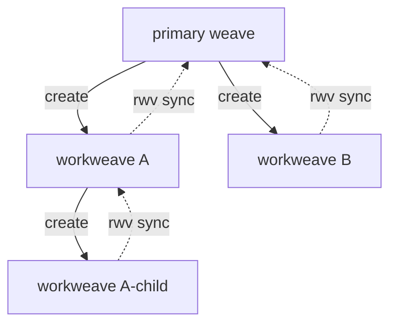

# Workweave hierarchy

A workweave is a worktree-derived copy of a workspace: its own
constituent-repo branches, its own ecosystem files, its own tool state.
Workweaves are how repoweave gives operators (and agents) parallel,
isolated cross-repo work without disturbing the primary weave.

Workweaves are not flat. A workweave can be created from inside another
workweave; the result is a tree. This joint explains the tree model, how
flow direction works, and what the tool tracks versus what the operator
must.

## The tree model

The root of the tree is always the primary weave. From there:

```
primary
├── workweave A                ← created from primary
│   └── workweave A-child      ← created from inside A
└── workweave B                ← created from primary
```

Each non-root node was *forked from* a single parent — the workspace
that was CWD when `rwv workweave create` ran. That parent is recorded;
see "Parent tracking" below.

The model is intentionally a tree, not a DAG. A workweave has exactly
one parent. There is no "merge two workweaves into one third one" at the
tool level — that would be a graph operation, and rwv does not own it.
Two sibling workweaves coordinate by syncing through their common
ancestor.

## Flow direction

Work flows along edges of the tree in a specific direction. Creation
runs down the edges (solid); sync runs back up them (dotted):



- **Creation direction** (primary → workweave). `rwv workweave create`
  forks from the current workspace. The child starts pinned to the
  parent's lock.
- **Landing direction** (workweave → primary). `rwv sync` brings the
  child's committed work *up* toward the root. Each `rwv sync` advances
  exactly one edge (one hop, see below).

The two directions are not symmetric — see
[sync-semantics](./sync-semantics.md) for the asymmetry-in-effect
discussion. The flow-direction discipline is *don't skip edges and don't
cross edges*: a child syncs to its parent, not to a sibling or to a
grandparent.

## Parent tracking is tool behavior

Until recently, workweave hierarchy was operator discipline: the tool
tracked the primary↔workweave edge only, and child-of-workweave
relationships were the operator's problem to remember.

That has changed. The `.rwv-workweave` marker file at every workweave
root now carries a `parent` field that records the workspace the
workweave was created from. The shape:

```yaml
primary: /home/user/work
project: web-app
parent: /home/user/work/.workweaves/web-app--feat   # parent workweave
```

`parent` is `primary` when the workweave was created from the primary
weave, and the parent-workweave path when the workweave was created from
inside another workweave. Legacy markers written before the field
existed parse cleanly — the read path backfills `parent` to `primary`
so callers always see a value.

This shifts two things from discipline to tool behavior:

1. **Bare `rwv sync` has a target.** Running `rwv sync` with no
   argument syncs to the recorded parent. From a child workweave that
   means the parent workweave, not the primary.
2. **`rwv sync --retire` knows what to retire to.** The retire flag
   syncs to the parent, verifies convergence, and deletes the workweave
   on success.

Anchored by the `.rwv-workweave` parent field plumbed through
`src/workspace.rs::WorkweaveMarker` and consumed by
`src/sync.rs::retire_workweave_after_sync`.

## One hop, not transitive

Bare `rwv sync` follows the parent edge — one hop. It does not chase
the tree up to the primary on its own. From a child of a workweave,
reaching primary takes two syncs:

```bash
cd .workweaves/web-app--feat-child
rwv sync                  # → parent workweave (web-app--feat)
cd ../web-app--feat
rwv sync                  # → primary
```

Or one explicit sync that names the target:

```bash
cd .workweaves/web-app--feat-child
rwv sync primary
```

The one-hop default is intentional. Transitive sync would silently land
the child's work in a workspace it was never forked from, bypassing the
intermediate review step. Explicit-target sync is always available when
the operator means it.

## What rwv tracks vs. what is discipline

Even with parent tracking, parts of the workweave model remain
operator-managed. Worth being explicit:

| Behavior | Tool support | Discipline |
|---|---|---|
| Recording the parent edge | Yes (`.rwv-workweave`) | — |
| Bare-sync auto-targets the parent | Yes | — |
| `--retire` lands one hop and deletes on success | Yes | — |
| Sibling-to-sibling coordination | No | Sync via shared parent |
| Cross-picking commits across branches | No | Use `git cherry-pick` directly |
| Promotion between branches in the project repo | No | Ordinary git workflow |
| Detecting unusual flow (skip-rebase, sibling sync) | Limited | Operator awareness |

The boundary is consistent with the principle in
[verb-vs-composition](./verb-vs-composition.md): rwv encodes
coordination the manifest knows and the VCS doesn't. The parent edge is
manifest-adjacent (recorded in workspace marker state); siblings and
cherry-picks are pure git operations on branches the operator can name.

## Naming and paths

Workweaves are co-located under `.workweaves/` at the parent workspace
root, named `<project>--<workweave-name>`:

```
primary/
├── .workweaves/
│   ├── web-app--feat/
│   │   └── .workweaves/
│   │       └── web-app--feat-child/
│   └── web-app--review-pr-42/
```

The `<project>` prefix is part of the directory name (not just metadata)
so multiple projects can host workweaves named identically without
collision.

A workweave's `.workweaves/` directory is its own children's parent;
the tree is naturally reflected in the filesystem path. This means
`find` and editor file pickers see the tree without any special tooling.

## Related joints

- [sync-semantics](./sync-semantics.md) — what happens when a sync runs
  between two workspaces on the tree.
- [pyramid-of-stability](./pyramid-of-stability.md) — the project-repo
  side of the canonical-tip story; orthogonal to workweave hierarchy.
- [verb-vs-composition](./verb-vs-composition.md) — why "sync through
  sibling" / "cross-pick across workweaves" aren't rwv verbs.
