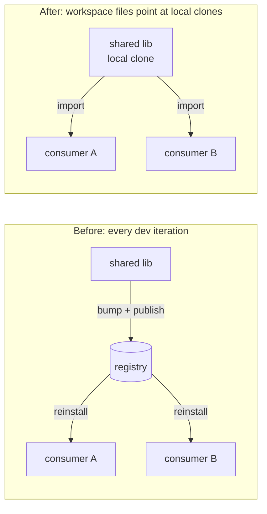

# The monorepo lens

> Monorepo ergonomics, polyrepo sovereignty.

This lens is about getting the development velocity and atomic feel of a monorepo while keeping repositories independent, separately ownable, and free of the costs that come with vendoring everything into a single tree.

Pick this lens up if you've ever lost an iteration to the version-bump dance: edit lib → commit → tag → wait for CI → bump consumer → reinstall, just to verify a two-line fix. Or if your "project" has drifted across repos onto incompatible versions of a shared internal library and nobody noticed until the build broke.

## The zero-version change

In a monorepo, you change a library and its consumer in the same commit. In a polyrepo, the typical workflow forces a version dance for every iteration — even when you know the change is small and the consumer is going to be fine.

repoweave eliminates the development-time version dance by generating ecosystem workspace files (`package.json` workspaces, `go.work`, `Cargo.toml`'s `[workspace]`, etc.) that point at the local clones. To the build tool, the manifest repos *are* the workspace members — it doesn't look on the registry for `@chatly/protocol`, it looks in `github/chatly/protocol/` on disk. This holds where the ecosystem can legally represent the active repos as one workspace; repos that declare their own nested workspace root (a Cargo limitation) must be opted out and are resolved via the registry instead (see [cargo-workspace opt-out](../../reference/integrations/cargo-workspace.md#nested-workspaces)).



The iteration loop collapses from minutes (or hours) down to seconds:

```bash
cd github/chatly/protocol
# edit the schema
cd ../server
cargo test --workspace             # picks up the new protocol immediately
```

No bump, no publish, no install. This collapses the feedback loop enough that small, iterative refactors that would otherwise be "too much work" become the default.

### Three cadences, stacked

"Eliminates the version dance" is true at dev-iteration time, but the win is bigger than that — it amortizes across three distinct cadences:

| Cadence | Frequency | Version dance? |
|---|---|---|
| **Dev iteration** (edit-test-iterate) | Many per day | None. Workspace points at local clones. |
| **Project release / deploy** | Many per week | None. The project's `rwv.lock` *is* the release artifact: it pins every constituent repo at a specific SHA. Cutting a tag on the project repo names a coherent multi-repo state without bumping any constituent-repo version. |
| **External-consumer release** of a constituent repo | Monthly, quarterly, or on demand | The dance lives here, at the *external consumer's* cadence. |

For constituent repos with no external consumers — common in proprietary projects where most repos are services or internal components — no semver is needed at all; the project lock is sufficient. For repos that do publish externally, the dance moves from every-dev-iteration cadence (painful) to external-consumer cadence (rare, usually negligible).

Ecosystem tools (Cargo, Go, npm) catch incompatible bumps during development — you discover constraint mismatches in the workspace before publishing, not after. See [release a package](../../how-to/release-a-package.md) for the external-release recipe.

## The pyramid of stability

In a monorepo, "the tip" is a single SHA. In a polyrepo, "the tip" is a moving target across N repos. What does "stable" mean when your system spans ten repositories that each move independently?

repoweave's answer is the project repo and its lock. A `rwv.lock` is a single artifact that captures the state of the entire cross-repo world — every manifest repo at an exact revision, every ecosystem dependency pinned. `sha256sum rwv.lock` is the project fingerprint. Two operators with the same checksum have identical source.

Branches of the project repo carry their own lock files. A `main` branch's lock points at one set of cross-repo tips; a `stable` branch's lock points at a vetted set; an `rc` branch's lock points at a release candidate. Cross-repo "channels" are just branches of the project repo, each carrying a coherent lock.

This is the [pyramid of stability](../joints/pyramid-of-stability.md): canonical cross-repo tips defined at the project layer, not invented per-repo. A fix-forward CI model becomes natural — CI advances the lock on a vetted branch as integration tests pass, downstream consumers fast-forward to the new lock.

## Workweaves: isolation without silos

Traditional isolation means cloning a repo into a temp folder — but then you lose the rest of the project context. The `git worktree` primitive solves this for one repo; repoweave extends the pattern across the project.

A **workweave** is a worktree-derived copy of an entire workspace. Each repo gets a git worktree on an ephemeral branch; ecosystem files are symlinked from the project directory (managed keys are merged, preserving user-authored content); `node_modules/`, `.venv/`, and `target/` are per-workweave. The primary weave stays undisturbed.

The hero moments:

- **Cross-repo feature branch** without contaminating your main workspace. Edit `protocol` and `server` on `feat/payments` worktrees side by side.
- **PR review** in isolation. Check out a PR's branches into a fresh workweave, run the build, throw the workweave away — no `git stash`, no dependency-state corruption.
- **Agent sandbox.** Give an agent a workweave so its experimental refactors are quarantined from the human's in-progress edits. See the [agent lens](./agent.md).
- **Parallel projects.** Work on two projects without `rwv activate` churn. A workweave on `mobile-app` lives alongside the primary weave on `web-app`.

Workweaves can be nested — a workweave can be created from inside another workweave. The result is a tree: primary → workweave → child workweave. Workweaves are not required to be ephemeral. A long-lived workweave (e.g., a "stable channel" workweave or an "agent gravity well" workweave) is a fine pattern. The model is a tree of workspaces with a flow direction, not a strict ephemeral-only discipline. See [workweave hierarchy](../joints/workweave-hierarchy.md) for the tree model.

## `rwv sync` and `rwv sync-to`: bringing the work home

In a monorepo, "merging your feature back to trunk" is one operation. In a polyrepo, it's N operations across N repositories — each with its own conflict potential.

repoweave's sync surface is a direction-explicit verb pair:

- **`rwv sync <source>`** — CWD absorbs the source workspace's state; CWD's unique commits land on top of source's tip. CWD changes; source is read-only. Use this to pull work in (e.g., absorb primary's new commits into a feature workweave before landing).
- **`rwv sync-to <target>`** — CWD's committed state lands in the target workspace. CWD absorbs the target's state first (CWD's commits on top), then the target fast-forwards to CWD's new tip. Both workspaces change; use this to push work out (e.g., land a feature workweave's commits into primary).

Both verbs run the same phase machine: first the manifest repos are advanced to the named workspace's lock targets using the chosen strategy (`ff` / `rebase` / `merge`); then CWD's unique project commits are replayed onto the named workspace's project tip with `rwv.lock` excluded from each commit's diff (lock-only commits become empty patches and are dropped); then `rwv.lock` is regenerated from the post-replay manifest tips. For `rwv sync-to`, a final step advances the target to CWD's new tip via fast-forward.

`rwv.lock` is never merged. It is recomputed fresh every time, so lock-file conflicts never arise regardless of how many workweaves are in flight. See [sync semantics](../joints/sync-semantics.md) and [lock-as-derived](../joints/lock-as-derived.md).

For the common case — work in a feature workweave, bring it home — the one-liner is:

```bash
cd .workweaves/web-app--payments
rwv sync-to --retire
```

`rwv sync-to --retire` lands CWD's commits into the recorded parent (one hop) and deletes the workweave on success. See [bring workweave work home](../../how-to/bring-workweave-work-home.md).

## Collective coordination, not VCS replacement

repoweave is a coordination layer, not a VCS wrapper. Two things follow from that distinction:

**Global visibility, local control.** `rwv status`, `rwv doctor` give a bird's-eye view across N repos — branches, tips, lock relations, drift detection. You don't have to round-robin through repositories to find out where things stand.

But ordinary git commands stay first-class. `git commit`, `git branch`, `git push` work in each manifest repo exactly as they always do. repoweave doesn't try to wrap them with `rwv commit` or `rwv branch` — those wrappers would be all friction and no signal.

For *coordinated* cross-repo operations where the value is in the coordination — role-aware push policy, lock-precondition checks, manifest-aware ordering — `rwv push` earns its keep. For ad-hoc bulk operations where the coordination is just "do this in each repo," unix composition (`rwv status --json | jq ... | xargs git ...`) is the right shape. See [verb-vs-composition](../joints/verb-vs-composition.md) for the design principle and [run a command across repos](../../how-to/run-a-command-across-repos.md) for canonical recipes.

The gita integration is an opt-in alternative for users who prefer a dedicated multi-repo CLI with "summary sugar"; see [reference/integrations/gita](../../reference/integrations/gita.md).

## Atomic-ish project snapshots

`rwv lock` produces a single artifact (`rwv.lock`) that records every repo at an exact revision plus the ecosystem lock files (`Cargo.lock`, `package-lock.json`, `uv.lock`, etc.) that pin external dependencies. Together they capture both layers — which commit of each repo, which versions of external deps — so reproducing the lock means reproducing the whole world.

This is monorepo atomic-ness without monorepo storage cost. The commit-and-lock dance is two phases (commit each repo, then `rwv lock` + commit the lock), not atomic the way a single monorepo commit is, but the result is the same: a coherent point-in-time snapshot of the entire system.

For projects where this matters more than the two-phase commit is worth, scripting it as a single command is straightforward — `rwv lock` is idempotent and the lock commit is mechanical.

## Where the monorepo equivalence holds (and where it doesn't)

A useful heuristic for staying inside the monorepo-ergonomics envelope:

> If you can't do it in a monorepo, you probably shouldn't do it in a weave.

Examples of things this rules out by analogy:

- **You can't cherry-pick between sibling branches of a monorepo subtree to share work** without going through trunk. Likewise, don't cross-pick between sibling workweaves. Coordinate via the shared parent (sync up, then sync down).
- **You can branch a whole monorepo at once.** The weave equivalent is a project-level branch with a matched branch across every manifest repo. Today this is per-repo manual work; conceptually it's the same operation.

The heuristic is a guideline, not a hard rule. Two patterns worth being explicit about:

**Long-lived workweaves are fine** when the flow direction is clear. A persistent "stable channel" workweave that always tracks the latest released lock is a reasonable architecture, not an anti-pattern. The tool tracks parent edges; the discipline is just "don't skip levels and don't cross-pick."

**Cross-repo branch-name consistency is a UX direction, not a hard rule.** Having `main` everywhere (or all `develop`) reduces cognitive load — but if some manifest repo's branch is `master` and another's is `trunk`, the workspace still works. The real UX gap is the absence of a one-verb cross-repo branch operation, not the names themselves.

## Guidelines

A few discipline-level patterns that keep a weave inside monorepo-ergonomics territory:

- **Don't skip levels in the workweave hierarchy.** Workweaves can form a tree (primary → long-lived workweave → feature workweave); changes propagate one hop at a time. Rebasing a feature workweave directly onto primary (skipping its parent) creates state that's hard to reason about. The tool tracks the parent edge; the operator respects flow direction.
- **Don't cross-pick between sibling workweaves.** Coordinate through the shared parent. Cross-picks are the polyrepo equivalent of branching off a sibling rather than trunk — git lets you do it, but the result is messy history.
- **Long-lived workweaves are good when upstream/downstream is clear.** A persistent workweave with an explicit "this syncs from primary" or "this is the channel everyone else syncs from" role is fine; an ambiguous long-lived workweave that's neither tracking nor tracked is a recipe for drift.

These are *guidelines*, not enforced constraints. The tool warns where it can (skip-rebase, sibling sync); the rest is operator awareness. See [workweave hierarchy](../joints/workweave-hierarchy.md) for what the tool tracks vs. what is discipline.

## The shape, in one paragraph

Workspace wiring eliminates the development-time version dance: edit a library, test its consumer, no bump or publish needed. `rwv.lock` captures the cross-repo state as a single fingerprint. Workweaves give you isolated parallel work without losing project context — your feature, the PR you're reviewing, the agent's sandbox, all coexist with the primary weave undisturbed. `rwv sync` and `rwv sync-to` move work between workspaces with the lock as the authoritative target — absorbing incoming state in one direction, landing outgoing commits in the other. Underneath, repoweave is a coordination layer: it manages multi-repo state but stays out of your VCS workflow, so `git` keeps its first-class role.

## Related

- [Workspace lens](./workspace.md) — the project-as-coordination-entity model this builds on
- [Agent lens](./agent.md) — the workweave-as-sandbox pattern for automation
- [Pyramid of stability](../joints/pyramid-of-stability.md) — canonical cross-repo tips
- [Sync semantics](../joints/sync-semantics.md) — the phase machine, abort, and snapshot-read contracts
- [Workweave hierarchy](../joints/workweave-hierarchy.md) — the tree model, flow direction
- [Verb-vs-composition](../joints/verb-vs-composition.md) — what earns an `rwv` verb
